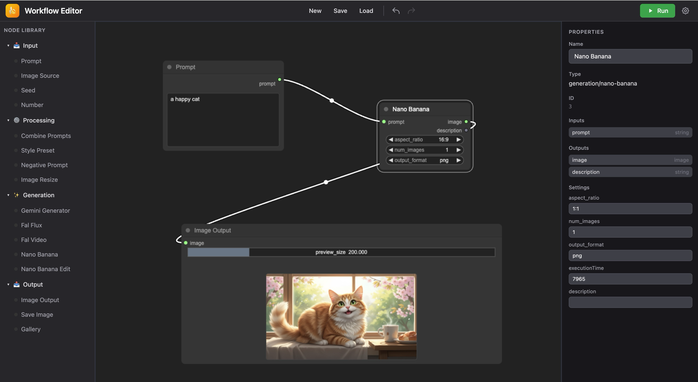

# NanoNodeBanana

[](https://opensource.org/licenses/MIT)
[](https://bun.sh)
[](https://www.typescriptlang.org/)
[](https://reactjs.org/)
[](https://tailwindcss.com/)
[](https://vitejs.dev/)

A visual node-based workflow editor for AI image generation, similar to ComfyUI. Create workflows by connecting nodes on a canvas and execute them to generate images using Google Gemini and Fal.ai models.



## Features

- **Visual Node Editor** - Drag-and-drop node-based interface powered by LiteGraph.js
- **Multiple AI Models** - Support for Google Gemini, Fal.ai Flux, and Nano Banana models
- **Image Editing** - Edit existing images with natural language using Nano Banana Edit
- **Real-time Preview** - See generated images directly in the workflow canvas
- **Workflow Management** - Save, load, and organize your workflows
- **Extensible Architecture** - Easy to add new node types and AI models

## Tech Stack

| Category | Technology |
|----------|------------|
| Runtime | [Bun](https://bun.sh) |
| Frontend | [React](https://reactjs.org) + [TypeScript](https://www.typescriptlang.org) |
| Styling | [Tailwind CSS](https://tailwindcss.com) v4 |
| Build Tool | [Vite](https://vitejs.dev) |
| Backend | [Elysia.js](https://elysiajs.com) |
| Database | SQLite via [better-sqlite3](https://github.com/WiseLibs/better-sqlite3) |
| Node Editor | [LiteGraph.js](https://github.com/jagenjo/litegraph.js) |
| AI Services | [Google Gemini](https://ai.google.dev), [Fal.ai](https://fal.ai) |

## Quick Start

### Prerequisites

- [Bun](https://bun.sh) >= 1.0.0
- Google Gemini API key
- Fal.ai API key

### Installation

```bash
# Clone the repository
git clone https://github.com/CodeWithBehnam/nanonodebanana.git
cd nanonodebanana

# Install dependencies
bun install

# Set up environment variables
cp .env.example .env
# Edit .env with your API keys
```

### Environment Variables

Create a `.env` file with:

```env
GEMINI_API_KEY=your_gemini_api_key
FAL_KEY=your_fal_api_key
```

### Development

```bash
# Run both frontend and backend
bun run dev

# Or run separately
bun run dev:client  # Frontend on port 6880
bun run dev:server  # Backend on port 6879
```

### Production Build

```bash
bun run build
bun run start
```

## Available Nodes

### Input Nodes
- **Prompt** - Text prompt input with inline editing
- **Image Source** - Upload images or provide URLs
- **Seed** - Random seed generator for reproducibility
- **Number** - Numeric value input

### Processing Nodes
- **Combine Prompts** - Merge multiple prompts
- **Style Preset** - Apply predefined style modifiers
- **Negative Prompt** - Define what to avoid in generation
- **Image Resize** - Resize or crop images

### Generation Nodes
- **Gemini Generator** - Google Gemini image generation
- **Fal Flux** - Fal.ai Flux models (Pro, Dev, Schnell)
- **Fal Video** - Video generation
- **Nano Banana** - Fast image generation
- **Nano Banana Edit** - Edit images with prompts

### Output Nodes
- **Image Output** - Display with resizable preview
- **Save Image** - Save to disk
- **Gallery** - Multi-image view

## Project Structure

```
nanonodebanana/
├── src/
│   ├── nodes/           # LiteGraph node definitions
│   │   ├── base/        # BaseNode factory
│   │   ├── input/       # Input nodes
│   │   ├── processing/  # Processing nodes
│   │   ├── generation/  # AI generation nodes
│   │   └── output/      # Output nodes
│   ├── components/      # React components
│   ├── context/         # React contexts
│   ├── lib/             # Utilities and API client
│   └── types/           # TypeScript types
├── server/
│   ├── routes/          # API routes
│   ├── services/        # AI service integrations
│   └── db/              # Database schema
└── docs/                # Documentation
```

## API Endpoints

| Endpoint | Method | Description |
|----------|--------|-------------|
| `/api/generate/gemini` | POST | Google Gemini generation |
| `/api/generate/fal` | POST | Fal.ai Flux generation |
| `/api/generate/nano-banana` | POST | Nano Banana generation |
| `/api/generate/nano-banana-edit` | POST | Nano Banana image editing |
| `/api/workflows` | GET/POST | List/create workflows |
| `/api/workflows/:id` | GET/PUT/DELETE | Workflow CRUD |
| `/api/upload/image` | POST | Image upload |

## Contributing

1. Fork the repository
2. Create a feature branch (`git checkout -b feature/amazing-feature`)
3. Commit your changes (`git commit -m 'feat: add amazing feature'`)
4. Push to the branch (`git push origin feature/amazing-feature`)
5. Open a Pull Request

## License

This project is licensed under the MIT License - see the [LICENSE](LICENSE) file for details.

## Acknowledgments

- [LiteGraph.js](https://github.com/jagenjo/litegraph.js) for the node editor framework
- [ComfyUI](https://github.com/comfyanonymous/ComfyUI) for inspiration
- [Fal.ai](https://fal.ai) for AI image generation APIs
- [Google Gemini](https://ai.google.dev) for generative AI capabilities

---

**Tags:** `ai` `image-generation` `workflow` `node-editor` `react` `typescript` `bun` `vite` `tailwindcss` `litegraph` `comfyui` `gemini` `fal-ai` `nano-banana`
