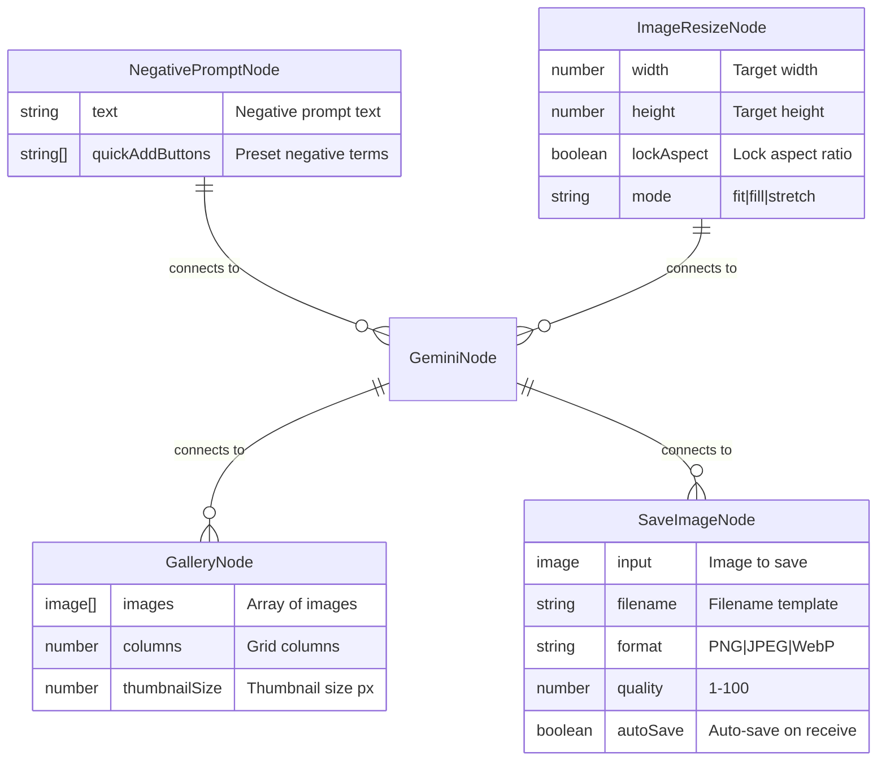

# Feature: Universal Node Resizing & Missing Node Enhancements

**Date:** 2025-12-24
**Status:** Draft
**Priority:** High
**Estimated Sprints:** 3-4 (6-8 weeks total)

---

## Overview

Enable universal node resizing across all node types in NanoNodeBanana and implement missing features from the original specification (`docs/litegraph-workflow-prompt.md`).

### Primary Goals
1. **Universal Node Resizing** - Allow all nodes to be resized with proper constraints
2. **Missing Node Types** - Implement NegativePromptNode, ImageResizeNode, GalleryNode, SaveImageNode
3. **Widget Enhancements** - Character count, quick-add buttons, progress indicators
4. **Interaction Features** - Drag-and-drop, clipboard paste, context menus, fullscreen view

---

## Problem Statement

### Current State
- Only 2 of 13 node types are resizable (PromptNode manually, ImageOutputNode via slider)
- Factory pattern (`BaseNode.ts`) partially supports resize via `showImagePreview` flag
- Several node types from spec are not implemented
- Missing widget features: character count, quick-add buttons, template variables
- No drag-and-drop or clipboard paste for images
- No context menus or fullscreen image view

### Impact
- Inconsistent UX - users expect all nodes to be resizable
- Limited workflow flexibility without missing node types
- Reduced productivity without drag-and-drop and paste support
- Poor discoverability of features without context menus

---

## Technical Approach

### Architecture Changes

#### 1. Extend NodeConfig Interface
**File:** `src/nodes/base/BaseNode.ts`

```typescript
export interface NodeConfig {
  // ... existing fields ...

  /** Enable node resizing (default: false) */
  resizable?: boolean

  /** Resize constraints */
  resizeConstraints?: {
    minWidth?: number
    minHeight?: number
    maxWidth?: number
    maxHeight?: number
    maintainAspectRatio?: boolean
  }
}
```

#### 2. Factory Pattern Enhancement
**File:** `src/nodes/base/BaseNode.ts`

- Add `resizable` flag handling in factory
- Implement min/max constraint enforcement in `onResize`
- Add circular update prevention flag (`_isResizing`)
- Calculate dynamic minimum size from content (slots + widgets)

#### 3. New Node Types
| Node | Category | Key Features |
|------|----------|--------------|
| NegativePromptNode | processing | Textarea + quick-add buttons |
| ImageResizeNode | processing | Width/height sliders, aspect ratio lock |
| GalleryNode | output | Multi-image grid, configurable layout |
| SaveImageNode | output | Format selector, quality slider, filename template |

---

## Implementation Phases

### Phase 1: Universal Node Resizing (Sprint 1)

#### Tasks

- [ ] **1.1 Extend NodeConfig interface**
  - Add `resizable?: boolean` option
  - Add `resizeConstraints?: { minWidth, minHeight, maxWidth, maxHeight }`
  - File: `src/nodes/base/BaseNode.ts:7-35`

- [ ] **1.2 Implement resize in factory pattern**
  - Check `config.resizable` flag
  - Set `this.resizable = true` when enabled
  - Apply constraints in `onResize` callback
  - File: `src/nodes/base/BaseNode.ts:118-387`

- [ ] **1.3 Add circular update prevention**
  - Add `_isResizing` flag to ExecutableNode interface
  - Guard `onResize` and widget change handlers
  - Prevent infinite loops between widget ↔ size sync
  - File: `src/nodes/base/BaseNode.ts:96-109`

- [ ] **1.4 Calculate dynamic minimum size**
  ```typescript
  const minHeight =
    LiteGraph.NODE_TITLE_HEIGHT +
    (inputs.length * LiteGraph.NODE_SLOT_HEIGHT) +
    (widgets.length * (LiteGraph.NODE_WIDGET_HEIGHT + 4)) +
    20 // padding
  ```

- [ ] **1.5 Enable resize for all node types**
  - Update each node to include `resizable: true` in config
  - Files: All nodes in `src/nodes/*/`

- [ ] **1.6 Test resize state persistence**
  - Verify `node.size` is saved in workflow JSON
  - Test: resize → save → reload → verify size restored

- [ ] **1.7 Add resize visual feedback**
  - Show resize grip icon on hover (bottom-right corner)
  - Cursor changes to `se-resize` when over resize handle
  - File: Custom CSS or canvas drawing

#### Acceptance Criteria
- [ ] All nodes can be resized by dragging bottom-right corner
- [ ] Nodes cannot be resized smaller than their content requires
- [ ] Resized node sizes persist across save/load
- [ ] No infinite loops between widget changes and resize
- [ ] Clear visual indication of resize capability

---

### Phase 2: Missing Widget Features (Sprint 2)

#### Tasks

- [ ] **2.1 Character count for PromptNode**
  - Display count in bottom-right of textarea area
  - Format: "245 chars" or "245 / 2000" (if limit exists)
  - Color coding: gray < 80%, yellow < 95%, red ≥ 95%
  - File: `src/nodes/input/PromptNode.ts` (onDrawForeground)

- [ ] **2.2 Quick-add buttons for NegativePromptNode**
  - Create new node: `src/nodes/processing/NegativePromptNode.ts`
  - Buttons: "blurry", "low quality", "watermark", "deformed", "bad anatomy"
  - On click: append to textarea with comma separator
  - Layout: 2 rows × 3 buttons below textarea

- [ ] **2.3 Randomize button for SeedNode**
  - Add "Randomize" button widget
  - On click: generate new seed immediately
  - Visual feedback: pulse animation
  - File: `src/nodes/input/SeedNode.ts`

- [ ] **2.4 Progress indicators for generator nodes**
  - Add progress bar in `onDrawForeground`
  - Position: thin bar (2-3px) below title
  - Color: blue (running), green (completed), red (error)
  - Files: `src/nodes/generation/*.ts`

- [ ] **2.5 Lock toggle for SeedNode**
  - Add "Lock" toggle widget
  - When locked: seed doesn't auto-randomize on execution
  - File: `src/nodes/input/SeedNode.ts`

#### Acceptance Criteria
- [ ] PromptNode shows live character count
- [ ] NegativePromptNode has clickable quick-add buttons
- [ ] SeedNode has working Randomize button and Lock toggle
- [ ] Generator nodes show progress during execution

---

### Phase 3: Missing Node Types (Sprint 3)

#### Tasks

- [ ] **3.1 Create NegativePromptNode**
  ```typescript
  // src/nodes/processing/NegativePromptNode.ts
  {
    title: 'Negative Prompt',
    category: 'processing',
    colour: '#dc2626', // Red
    outputs: [{ name: 'negative', type: 'string' }],
    widgets: [
      { name: 'text', type: 'textarea', defaultValue: '' }
    ],
    resizable: true,
    // Quick-add buttons rendered in onDrawForeground
  }
  ```

- [ ] **3.2 Create ImageResizeNode**
  ```typescript
  // src/nodes/processing/ImageResizeNode.ts
  {
    title: 'Image Resize',
    category: 'processing',
    colour: '#0891b2', // Cyan
    inputs: [{ name: 'image', type: 'image' }],
    outputs: [{ name: 'resized', type: 'image' }],
    widgets: [
      { name: 'width', type: 'number', defaultValue: 512 },
      { name: 'height', type: 'number', defaultValue: 512 },
      { name: 'lock_aspect', type: 'toggle', defaultValue: true },
      { name: 'mode', type: 'combo', options: { values: ['fit', 'fill', 'stretch'] } }
    ],
    showImagePreview: true,
    imageProperty: 'preview'
  }
  ```

- [ ] **3.3 Create GalleryNode**
  ```typescript
  // src/nodes/output/GalleryNode.ts
  {
    title: 'Gallery',
    category: 'output',
    colour: '#059669', // Emerald
    inputs: [{ name: 'images', type: 'image' }], // Accepts array
    widgets: [
      { name: 'columns', type: 'number', defaultValue: 2 },
      { name: 'thumbnail_size', type: 'slider', defaultValue: 100, options: { min: 50, max: 300 } }
    ],
    resizable: true
  }
  ```

- [ ] **3.4 Create SaveImageNode**
  ```typescript
  // src/nodes/output/SaveImageNode.ts
  {
    title: 'Save Image',
    category: 'output',
    colour: '#475569', // Slate
    inputs: [{ name: 'image', type: 'image' }],
    widgets: [
      { name: 'filename', type: 'text', defaultValue: 'output_{index}' },
      { name: 'format', type: 'combo', options: { values: ['PNG', 'JPEG', 'WebP'] } },
      { name: 'quality', type: 'slider', defaultValue: 90, options: { min: 1, max: 100 } },
      { name: 'auto_save', type: 'toggle', defaultValue: false }
    ],
    showImagePreview: true,
    imageProperty: 'preview'
  }
  ```

- [ ] **3.5 Register new nodes**
  - Update `src/nodes/index.ts` with new node paths
  - Add to NODE_PATHS object

- [ ] **3.6 Create backend endpoint for SaveImageNode**
  - `POST /api/save` - Save image to disk
  - File: `server/routes/save.ts`

#### Acceptance Criteria
- [ ] NegativePromptNode appears in node panel under "Processing"
- [ ] ImageResizeNode can resize images with aspect ratio lock
- [ ] GalleryNode displays multiple images in a grid
- [ ] SaveImageNode can download images in PNG/JPEG/WebP formats

---

### Phase 4: Interaction Features (Sprint 4)

#### Tasks

- [ ] **4.1 Drag-and-drop image upload**
  - Add global drop event handler to `WorkflowCanvas.tsx`
  - Detect node at cursor position
  - If ImageSourceNode → load dropped image
  - If empty canvas → create new ImageSourceNode
  - Visual feedback: drop zone highlight
  - File: `src/components/WorkflowCanvas.tsx`

- [ ] **4.2 Clipboard paste support**
  - Add global paste event handler (Ctrl+V)
  - Target: last selected ImageSourceNode or create new
  - Read clipboard: `navigator.clipboard.read()`
  - Handle permission prompt gracefully
  - File: `src/components/WorkflowCanvas.tsx`

- [ ] **4.3 Context menus**
  - Research LiteGraph.ContextMenu API
  - Add custom items to image nodes:
    - "View Fullscreen"
    - "Copy to Clipboard"
    - "Save Image"
    - "Send to ImageSourceNode"
  - File: Custom context menu integration

- [ ] **4.4 Fullscreen image view**
  - Create React Portal modal component
  - Display image centered, max viewport size
  - Zoom: mousewheel + buttons
  - Pan: click-drag
  - Close: Escape, click outside, X button
  - File: `src/components/FullscreenImageModal.tsx`

- [ ] **4.5 Keyboard shortcuts**
  - Verify existing LiteGraph shortcuts work
  - Add custom shortcuts:
    - `Ctrl+Arrow` - resize selected node
    - `Double-click image` - fullscreen view
    - `?` - show keyboard shortcut reference
  - File: `src/components/WorkflowCanvas.tsx`

#### Acceptance Criteria
- [ ] Can drag image files from desktop onto ImageSourceNode
- [ ] Can paste images with Ctrl+V
- [ ] Right-click on images shows context menu with actions
- [ ] Double-click image opens fullscreen view with zoom/pan
- [ ] All keyboard shortcuts documented and working

---

## File Changes Summary

### New Files
```
src/nodes/processing/NegativePromptNode.ts
src/nodes/processing/ImageResizeNode.ts
src/nodes/output/GalleryNode.ts
src/nodes/output/SaveImageNode.ts
src/components/FullscreenImageModal.tsx
src/components/ContextMenu.tsx
server/routes/save.ts
```

### Modified Files
```
src/nodes/base/BaseNode.ts           # NodeConfig interface, resize handling
src/nodes/index.ts                   # Register new nodes
src/nodes/input/PromptNode.ts        # Character count display
src/nodes/input/SeedNode.ts          # Randomize button, Lock toggle
src/nodes/input/ImageSourceNode.ts   # Drag-and-drop, paste support
src/nodes/generation/GeminiNode.ts   # Progress indicator
src/nodes/generation/FalFluxNode.ts  # Progress indicator
src/components/WorkflowCanvas.tsx    # D&D, paste, keyboard handlers
src/components/PropertiesPanel.tsx   # Resize sync improvements
src/types/nodes.ts                   # New types for features
server/index.ts                      # Register save route
```

---

## Edge Cases & Risks

### Edge Cases to Handle
- Resize below minimum content size → constrain to minimum
- Resize during execution → disable resize when status === 'running'
- Multi-select resize → apply proportionally to all selected
- Drop non-image file → show error toast
- Paste when no ImageSourceNode exists → create new node
- Fullscreen on small viewport → responsive sizing

### Risks & Mitigations
| Risk | Impact | Mitigation |
|------|--------|------------|
| Circular update loops | High | Add `_isResizing` flag |
| Performance with 50+ nodes | Medium | Throttle onResize to 60fps |
| Large image memory issues | Medium | Downscale previews, lazy load |
| Browser clipboard permissions | Low | Graceful permission prompt |

---

## Testing Strategy

### Unit Tests
- [ ] Min/max size constraint calculations
- [ ] Circular update prevention
- [ ] Widget ↔ property sync

### Integration Tests
- [ ] Resize node → save workflow → reload → verify size
- [ ] Drag-and-drop file → verify image loads
- [ ] Context menu actions execute correctly

### E2E Tests
- [ ] Complete workflow: prompt → generate → output → save
- [ ] Resize multiple nodes → check all persist
- [ ] Keyboard navigation and shortcuts

---

## Success Metrics

1. **All nodes resizable** with proper constraints
2. **Zero infinite loops** in widget ↔ resize sync
3. **< 16ms frame time** during resize operations (60fps)
4. **100% of spec features** from litegraph-workflow-prompt.md implemented
5. **Resize state persists** across save/load cycles

---

## References

### Internal Files
- Factory pattern: `src/nodes/base/BaseNode.ts:118-387`
- Canvas setup: `src/components/WorkflowCanvas.tsx:44-129`
- Properties panel: `src/components/PropertiesPanel.tsx`
- Node registration: `src/nodes/index.ts`
- Spec document: `docs/litegraph-workflow-prompt.md`

### External Documentation
- [LiteGraph.js GitHub](https://github.com/jagenjo/litegraph.js)
- [LiteGraph Node Creation Guide](https://github.com/jagenjo/litegraph.js/blob/master/guides/README.md)
- [ComfyUI Node Interface](https://comfyui-wiki.com/en/interface/node-options)

---

## ERD: New Node Types



---

## Appendix: Quick-Add Buttons Data

```typescript
// For NegativePromptNode
const NEGATIVE_PRESETS = [
  { label: 'Blurry', value: 'blurry, out of focus, unfocused' },
  { label: 'Low Quality', value: 'low quality, low resolution, pixelated' },
  { label: 'Watermark', value: 'watermark, text, logo, signature' },
  { label: 'Deformed', value: 'deformed, distorted, disfigured' },
  { label: 'Bad Anatomy', value: 'bad anatomy, extra limbs, missing limbs' },
  { label: 'Artifacts', value: 'jpeg artifacts, compression artifacts, noise' },
]
```

---

**Plan created by:** Claude Code
**Last updated:** 2025-12-24
